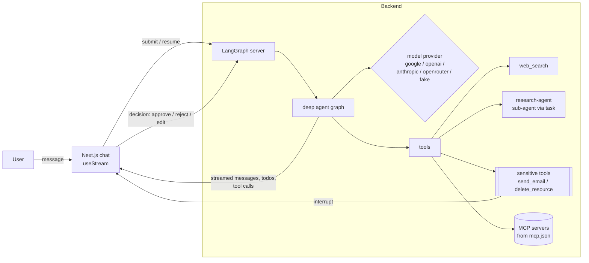

# Agent Harness

A production-shaped harness for deep agents: a Python backend built on
`deepagents` + LangGraph + Gemini with pluggable MCP tools, paired with a Next.js
chat frontend that streams the agent's plan, tool calls, sub-agent runs, and
human-approval gates in real time.

The point of this repo is not a clever agent — it's the scaffolding around one.
Model provider, tools, persistence, and human-in-the-loop are all separated so a
credential or model problem can never be a harness problem.

## What's inside

**Backend — the agent loop** (`backend/src/agent_harness/`)

- A deep agent assembled with `create_deep_agent` (`agent.py`). It plans with a
  `write_todos` tool, delegates focused research to a `research-agent` sub-agent
  through the built-in `task` tool, and uses filesystem tools for intermediate
  artifacts.
- A **model provider knob** (`models.py`): `MODEL_PROVIDER` selects Google
  (Gemini, the default), OpenAI, Anthropic, OpenRouter, or a deterministic
  `fake` scripted model. The graph is identical across all of them.
- **Human-in-the-loop gating** (`tools.py`): sensitive tools (`send_email`,
  `delete_resource`) are registered as interrupts, so the graph pauses and waits
  for an explicit approve / reject / edit / respond decision before executing.
- **Optional MCP tools** (`mcp.py`): drop an `mcp.json` next to `langgraph.json`
  and its servers' tools are loaded and merged in. Loading is best-effort — a bad
  MCP config logs a warning and returns nothing rather than taking the agent down.
- Served through the LangGraph dev server via `langgraph.json`; persistence
  (checkpointer + store) is injected by the runtime, not hard-coded into the graph.

**Frontend — the chat harness** (`frontend/src/`)

- A single-page chat UI (`components/Harness.tsx`) built on
  `@langchain/langgraph-sdk`'s `useStream`, streaming assistant tokens and tool
  calls as they happen.
- A **live plan panel** (`TodoPanel.tsx`) that renders the agent's `write_todos`
  state with per-item status and a progress bar.
- An **approval card** (`InterruptCard.tsx`) that renders a paused interrupt —
  including batched multi-action requests — and submits the user's decisions back
  to resume the run.
- A **sub-agent activity panel** derived from `task` tool calls, showing each
  sub-agent run as running or done.
- Thread persistence in the URL, so a refresh reconnects to an in-flight stream
  and rehydrates plan + interrupt state.

## Architecture



Flow: the frontend submits a message to the LangGraph server, which runs the deep
agent. The agent plans (todos), calls tools, and may spawn the research
sub-agent. When it reaches a sensitive tool it raises an interrupt; the server
streams that pause to the UI, the user decides, and the decision resumes the run.
Plan state, tool calls, and sub-agent progress stream back the whole time.

## Key design decisions

These are the choices the code actually makes, and why.

- **Provider is a knob, not a rewrite.** `get_model()` returns a `BaseChatModel`
  for any of five providers behind one interface, so switching models never
  touches the graph. The `fake` scripted model lets the whole harness — planning,
  sub-agent delegation, and the HITL interrupt — run offline and deterministically
  with no API keys.
- **Gemini thinking is disabled by default.** In long tool-using loops
  `gemini-2.5-*` dynamic thinking can spend a turn thinking and emit no tool call
  or text. The harness sets `thinking_budget=0` by default (overridable via
  `GOOGLE_THINKING_BUDGET`) to keep tool use reliable.
- **MCP failure is contained.** MCP loading is wrapped so any error returns an
  empty tool list with a warning — features degrade, the agent never dies.
- **Sensitive tools pause instead of asking nicely.** Approval is enforced at the
  graph level with real LangGraph interrupts (approve / edit / reject / respond),
  not by prompting the model to behave.
- **The UI defends against stale state.** The frontend explicitly handles three
  failure modes: a resolved interrupt can't render twice (tracked resolved-ids +
  optimistic hide), the previous turn's todos are cleared before a new turn so a
  stale plan can't leak, and `reconnectOnMount` + `fetchStateHistory` resume an
  in-flight stream and rehydrate plan/interrupt state after a refresh.
- **No hidden persistence in the graph.** The graph ships without its own
  checkpointer so it doesn't fight the LangGraph runtime's injected persistence;
  standalone scripts pass one explicitly via `build_agent(checkpointer=...)`.

## Quickstart

Prerequisites: Python 3.11+ and [`uv`](https://docs.astral.sh/uv/), Node.js with
`pnpm`.

**Backend**

```bash
cd backend
cp .env.example .env          # add your GOOGLE_API_KEY (or set MODEL_PROVIDER=fake)
uv sync
uv run langgraph dev          # serves the "harness" graph on http://localhost:2024
```

Backend environment variables:

| Variable                 | Default            | Purpose                                        |
| ------------------------ | ------------------ | ---------------------------------------------- |
| `MODEL_PROVIDER`         | `google`           | `google` / `openai` / `anthropic` / `openrouter` / `fake` |
| `GOOGLE_API_KEY`         | —                  | Gemini key (required for the default provider) |
| `GOOGLE_MODEL`           | `gemini-2.5-flash` | Gemini model id                                |
| `GOOGLE_THINKING_BUDGET` | `0`                | Gemini thinking budget (0 disables)            |

Other providers read their own keys/models (`OPENAI_MODEL`, `ANTHROPIC_MODEL`,
`OPENROUTER_API_KEY` / `OPENROUTER_MODEL`). Set `MODEL_PROVIDER=fake` to run with
no keys at all.

**Frontend**

```bash
cd frontend
pnpm install
pnpm dev                      # http://localhost:3000
```

Frontend environment variables (`.env.local`):

| Variable                          | Default                 | Purpose                    |
| --------------------------------- | ----------------------- | -------------------------- |
| `NEXT_PUBLIC_LANGGRAPH_API_URL`   | `http://localhost:2024` | LangGraph server URL       |
| `NEXT_PUBLIC_ASSISTANT_ID`        | `harness`               | Graph id from `langgraph.json` |

Then try: *"Please send an email to bob"* (plan → approval gate) or *"Research
deep agents"* (sub-agent delegation).

## Status

Working demo. The tools (`web_search`, `send_email`, `delete_resource`) are
deliberately stubbed so the harness runs and is testable offline — the interesting
part is the scaffolding around them, which is real: provider abstraction,
MCP loading, human-in-the-loop gating, streaming, and the UI's stale-state
handling. Swap the stubs for real tools (Tavily/Exa for search, a real mailer,
your own MCP servers) to make it do work.

## Author

Built by [Mugilan Sakthivel](https://mugilans.in).
