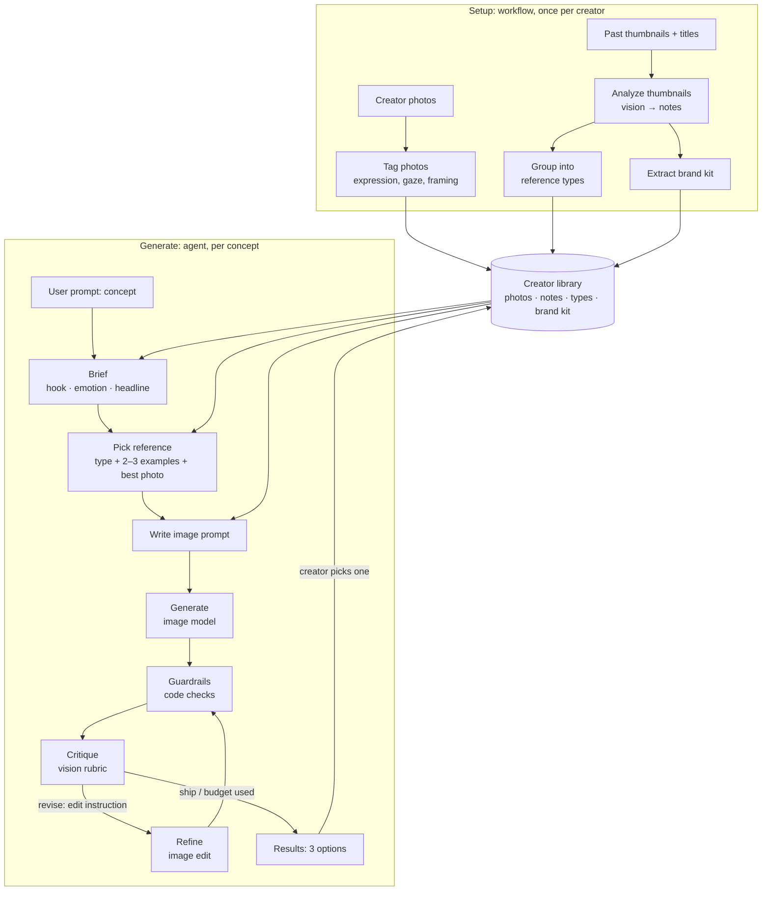

# System design: Thumbnail Agent

Status: **draft v0.2 for review.** Nothing is built yet. Phase 1 spikes may change
any of this.

## What changed from v0.1

| v0.1 | v0.2 (now) |
| --- | --- |
| Thumbnail drawn by code (HTML/CSS → PNG) | **An AI image model generates the thumbnail** (OpenAI or Gemini). It uses the creator's photo and the chosen reference thumbnails as image inputs. Code only adds text (Tamil text, or a fallback when the model misspells) |
| 10 references picked by hand | **The agent finds the creator's reference types** in their own channel thumbnails, and picks the right type for each new concept |
| Brief as a form | **Any concept, typed as a free-form user prompt.** System prompts turn it into a design |
| Stack recommended | Stack decided: **Next.js + Vercel AI SDK**, with OpenAI or Gemini for image generation (switchable) |

## 1. Goal

A creator sets up once with their photos and their past thumbnails. After that
they can type **any video concept** and get **3 thumbnail options** that:

- look like *their* channel, in the same styles their audience already recognises,
- show *their* face, which still looks like them,
- spell the headline correctly and stay readable at phone size,
- come with a score and a short reason for each.

**Not goals for v1:** writing video titles, posting to YouTube, or making video.

## 2. User flow

**Setup (once per creator, about 2 minutes)**

1. Upload 3–5 HD photos (different expressions, the kind they already use in thumbnails).
2. Upload 20–30 past thumbnails, each with its video title if possible.
3. The agent analyses the thumbnails and shows two things: **"Your thumbnail
   styles"** (the reference types, each with examples) and **your brand kit**.
4. The creator renames, merges or removes styles if the agent got them wrong.

**Generate (every video)**

1. Type the concept, e.g. *"I let 5 AI agents build the same app, one of them cheated"*.
2. Optionally choose the text language (English / Tamil / Tanglish) and the image
   provider.
3. Watch the agent work: brief → pick reference → image prompt → generate →
   critique → refine.
4. Get 3 options with scores. Download one, or pick one so the agent remembers
   the choice.

## 3. Architecture



Setup always runs the same steps in the same order, so it is a **workflow**.
Generate is where the model makes real decisions: which style fits, what to fix,
and when to stop. That part is the **agent**. Saying that clearly on camera is a
trust point.

## 4. Prompts: system and user

The creator only ever writes the **user prompt** (the concept). Everything else
is a **system prompt** we write, version, and improve using evals.

| Prompt | Kind | Job | Input → output |
| --- | --- | --- | --- |
| **Thumbnail analyst** | system (vision) | Describe one past thumbnail precisely | image + title → `ThumbnailNote` |
| **Style librarian** | system | Group the notes into reference types | all notes → `ReferenceType[]` + `BrandKit` |
| **Photo tagger** | system (vision) | Tag each creator photo | photo → `CreatorPhoto` tags |
| **Strategist** | system | Turn a concept into a thumbnail brief | **user prompt** + brand kit → `Brief` |
| **Art director** | system | Pick the reference type, examples and photo | brief + types + photo tags → `ReferencePick` |
| **Image prompt writer** | system | Write the prompt for the image model | brief + pick + brand kit → `ImagePrompt` |
| **Critic** | system (vision) | Score the render and say what to fix | render + creator photo + brief → `Critique` |

All of these live in `app/prompts/` as plain files with a version number, so
episodes can show the real prompt, and evals can compare prompt v3 with v4.

The strategist and art director can be merged into one call if the evals show no loss.

## 5. Stages

Each stage has a visible output, so it can be checked by eye before the next one is built.

### Setup

**S1. Analyze thumbnails (vision).** Each thumbnail, plus its title, becomes a
`ThumbnailNote`: layout, face (position, size, expression), text (exact words,
word count, style), objects, colours and topic. Batch 4–5 thumbnails per call.
*Check:* the notes table matches what you see.

**S2. Reference types.** One text call groups the notes into **3–7 reference
types**. Examples: "Shocked face + 2-word claim", "Tool logo vs. tool logo",
"Before / after split", "Screenshot + red arrow". Each type has a name, a "use
when" (which kinds of concepts it suits), a visual recipe, and example thumbnail
ids. *Check:* the creator agrees these are their styles, and can edit them.

**S3. Brand kit.** Palette (from the model, cross-checked by pixel colours in
code), text style, face style, recurring elements, and things to avoid. *Check:*
"Is this you?"

**S4. Tag photos.** Expression, gaze, framing, and which side is empty. The model
only needs a small copy of each photo. The image generator gets the full HD photo.

### Generate

**G1. Brief.** User prompt → `Brief`: hook, emotion, headline (≤ N words, never
the full title), key objects, and angle. This is validated JSON.

**G2. Pick reference.** The model chooses the reference type whose "use when"
fits the brief, and explains why. Then it chooses 2–3 example thumbnails of that
type, and the creator photo whose expression matches the emotion. With 20–30
thumbnails the model can pick directly. With hundreds, **embeddings** find the
closest examples first, which is the retrieval concept. For 3 options, it picks
the top 2–3 types, or one type with 3 variations.

**G3. Image prompt.** One structured prompt for the image model:
- **Image 1 is the creator.** Keep the same person, face, hair and skin tone.
- **Images 2–3 are style references.** Match their layout, framing, colour
  treatment and text styling. Do **not** copy their text, people or logos.
- **Composition:** where the face goes and how big it is, the background, and props.
- **Text:** the exact headline in quotes, plus its position and style. Or no
  text at all when we overlay it with code (Tamil, or fallback).
- **Brand:** palette and recurring elements from the brand kit.
- **Format:** 16:9, high contrast, readable at phone size.

**G4. Generate (tool).** `generate_thumbnail(prompt, images[])` calls the chosen
provider, then code resizes the result to exactly 1280×720.

**G5. Guardrails (code, no model call).**
- Aspect ratio and size are correct, and the file is under 2 MB.
- The headline length is within limits (checked before generating).
- **Cost cap:** at most 9 image calls per run (3 options × 1 generate + 2 edits).
- **Round cap:** 2 refine rounds per option.
- **Text overlay mode** (Tamil/fallback): the font actually rendered, with no
  broken glyphs.

**G6. Critique (vision).** The critic sees the render at full size **and** at
phone size (about 320×180), next to the creator's real photo. It scores:

| Rubric | What it means |
| --- | --- |
| Face match | Is it clearly the same person? |
| Text accuracy | Does the rendered text exactly match the headline? |
| Phone readability | Can you read it at 320×180? |
| Reference match | Does it look like the chosen style? |
| Brand match | Does it look like this channel? |
| Curiosity | Would you want to click? |
| Clutter | Is it clean, with one idea? |
| Badge zone | Is anything important in the bottom-right corner, where YouTube shows the duration? |

It returns `ship` or `revise`, with **one specific edit instruction** (e.g.
"Make the headline 30% larger and move it top-left. Keep everything else.").
Face match and text accuracy are **hard gates**: an option fails if either one
fails, whatever the other scores are.

**G7. Refine (tool).** `edit_thumbnail(image, instruction, creatorPhoto)` calls
the image model again with the current render plus the instruction. The creator
photo goes in again to anchor the face. We keep the **best** version, not the
last one, because edits can make things worse.

**G8. Results + memory.** 3 options, with scores, round history, the chosen
reference type and the reason it was chosen. When the creator picks one, the
pick and the reason are saved, and they shape future style picks.

### Tools the agent can call (generate loop)

| Tool | Does |
| --- | --- |
| `pick_reference(brief)` | Returns a reference type, example ids, a photo id and the reason |
| `generate_thumbnail(prompt, images)` | Returns a 1280×720 PNG |
| `edit_thumbnail(image, instruction, photo)` | Returns the edited PNG |
| `check_guardrails(image)` | Returns pass or fail with reasons |
| `critique(image, brief)` | Returns rubric scores, a verdict and an edit instruction |
| `overlay_text(image, headline, style)` | Draws text in code, for Tamil or as a fallback |

## 6. Image generation

| | OpenAI | Gemini |
| --- | --- | --- |
| Model (config) | `gpt-image-2` (released June 2026) or `gpt-image-1` | Nano Banana Pro (`gemini-3-pro-image…`) or a Flash image model |
| Reference images | Edits accept multiple input images (up to 16 reported) | Multi-image input supported |
| Through AI SDK | Image models use `generateImage` | Gemini image models return images from `generateText` as `result.files` |
| Free API tier | No | **No** for Nano Banana Pro (0 RPM on the free tier, roughly $0.13 per 1K/2K image on the paid tier) |

**Things to know:**
- **Image generation costs money with both providers.** Text and vision steps
  (analysis, brief, critique) can stay on Gemini's free tier. Only G4 and G7
  need billing. A run with the cap above makes at most 9 image calls. Measure the
  real cost per run in Phase 1 before saying any number on camera, and check
  current prices in each console. Viewers will need billing enabled too, so the
  setup episode must say that clearly.
- **This sandbox can reach Gemini's API, but `api.openai.com` is blocked** by the
  environment's network policy. Allow it before we test OpenAI here.
- **Text:** both providers now render English text well. That is a measured
  claim to check (critic: text accuracy). Tamil is the risky one, so plan on
  code overlay for Tamil unless the spike proves otherwise.
- **Face:** identity drift is the biggest risk for a creator tool. If face match
  keeps failing, the fallback is to generate the scene **without** the person
  and composite the real photo cutout in code.

## 7. Data contracts

These become zod schemas in the app, so every model output is validated.

```ts
type CreatorPhoto = {
  id: string; path: string;                       // full-res original
  expression: string;                             // "shocked", "smiling", "pointing right"
  gaze: "left" | "right" | "camera";
  framing: "close-up" | "half-body";
  emptySide: "left" | "right" | "none";
};

type ThumbnailNote = {
  id: string; title?: string;
  layout: string;                                 // "face right, text left, object centre"
  face: { present: boolean; position?: "left" | "right" | "center"; size?: "small" | "medium" | "large"; expression?: string };
  text: { words: string; wordCount: number; style: string };
  objects: string[];                              // logos, arrows, screenshots, props
  colors: string[];
  topic: string;
};

type ReferenceType = {
  id: string; name: string;                       // "Shocked face + 2-word claim"
  description: string;
  useWhen: string[];                              // concept signals this style suits
  recipe: string;                                 // how to build it, for the image prompt
  exampleIds: string[];
};

type BrandKit = {
  palette: { primary: string; accent: string; text: string; backgrounds: string[] };
  textStyle: string;                              // "heavy white sans, black stroke, 2–3 words"
  faceStyle: string;                              // "close-up, exaggerated emotion, right third"
  recurring: string[];
  avoid: string[];
};

type Brief = {
  concept: string;                                // the user prompt, verbatim
  hook: string; emotion: string;
  headline: string;                               // ≤ N words
  keyObjects: string[]; angle: string;
  language: "en" | "ta" | "tanglish";
};

type ReferencePick = { typeId: string; exampleIds: string[]; photoId: string; reason: string };

type ImagePrompt = {
  prompt: string;
  images: { role: "creator" | "reference"; id: string }[];
  textMode: "model" | "overlay";
};

type Critique = {
  scores: {
    faceMatch: number; textAccuracy: number; phoneReadability: number;
    referenceMatch: number; brandMatch: number; curiosity: number; clutter: number;  // 1–5
  };
  badgeZoneClear: boolean;
  overall: number;
  verdict: "ship" | "revise";
  editInstruction?: string;
};
```

## 8. Evals: how we know it got better

- **Test set:** 10 concepts taken from the creator's real past videos. We have
  their real thumbnails, which gives us something to compare against.
- **Measured per run:**
  - face match pass rate
  - text accuracy pass rate
  - critic score from a separate judge prompt
  - rounds used
  - **cost and time per run**
  - **blind pairwise pick: agent vs. the creator's real thumbnail.** You plus 2–3
    people answer "which would you click?" This number matters most.
- **Pairwise beats absolute.** Model judges are much steadier at "A or B?" than on 1–5 scales.
- **Change one thing at a time** (a prompt version, a model, a reference
  strategy), rerun the set, and log it in `evals/results.md`. That table is the
  "watch it improve" story for the series.
- **Real-world proof:** YouTube Studio's *Test & Compare* on a real upload, agent vs. handmade.

## 9. Stack

| Part | Choice |
| --- | --- |
| App | Next.js (App Router), TypeScript |
| AI | Vercel AI SDK. Text and vision on Gemini (free tier while building), images on OpenAI or Gemini via `IMAGE_PROVIDER` |
| Schemas | zod |
| Image ops | sharp (resize to 1280×720, phone-size copy, compositing) |
| Text overlay | HTML/CSS rendered in headless Chromium (handles Tamil correctly) |
| Storage | Local files while building. Vercel Blob (or similar) when deployed |
| UI theme | claude.dev look, in light mode (see `design/`) |
| Deploy | Vercel, linked from mugilans.in or ageofagi.in |

Config, all in env: `TEXT_MODEL`, `IMAGE_PROVIDER`, `IMAGE_MODEL`,
`GOOGLE_GENERATIVE_AI_API_KEY`, `OPENAI_API_KEY`, `MAX_IMAGE_CALLS`.

## 10. Phase 1 spikes (run these before building the app)

| # | Question | How we test | Pass when |
| --- | --- | --- | --- |
| 1 | **Face:** does the creator still look like himself? | 5 concepts × 2 providers, one photo as input | You say "that's him" on at least 4 of 5 |
| 2 | **Style:** does the output follow a reference type without copying it? | Same 5 concepts, 2–3 reference thumbnails as input | It reads as "his channel", and no reference text or face is copied |
| 3 | **Text:** English spelling, and Tamil | 10 headlines in each language | English always correct. Tamil decides overlay vs. model |
| 4 | **Critic:** does it catch planted problems? | Wrong face, a misspelled word, tiny text, a cluttered image | It catches every planted problem |
| 5 | **SDK:** can AI SDK pass reference images to both providers? | One call per provider | It works, or we call the provider SDK inside our tool |
| 6 | **Cost:** what does one run cost? | Log the calls in spikes 1–3 | A number per run, per provider |

## 11. What we need from you

1. **Theme source:** add `claude.dev` to this environment's allowed domains, or
   paste the site's CSS. Until then, the design tokens are provisional.
2. **The creator:**
   - His consent to use his face and thumbnails.
   - 3–5 HD photos.
   - 20–30 past thumbnails **with their video titles**. The titles become the
     eval set.
   - Share these through a **private** repo or a folder, not this public repo.
3. **API keys**, stored as environment secrets (never pasted in chat):
   `GOOGLE_GENERATIVE_AI_API_KEY`, plus `OPENAI_API_KEY` if we test OpenAI.
   Turn on billing for image generation.
4. **Network:** allow `api.openai.com` if we test OpenAI.
5. **Thumbnail text language** for this creator.
6. **Budget cap** per month for image generation while we build and run evals.
