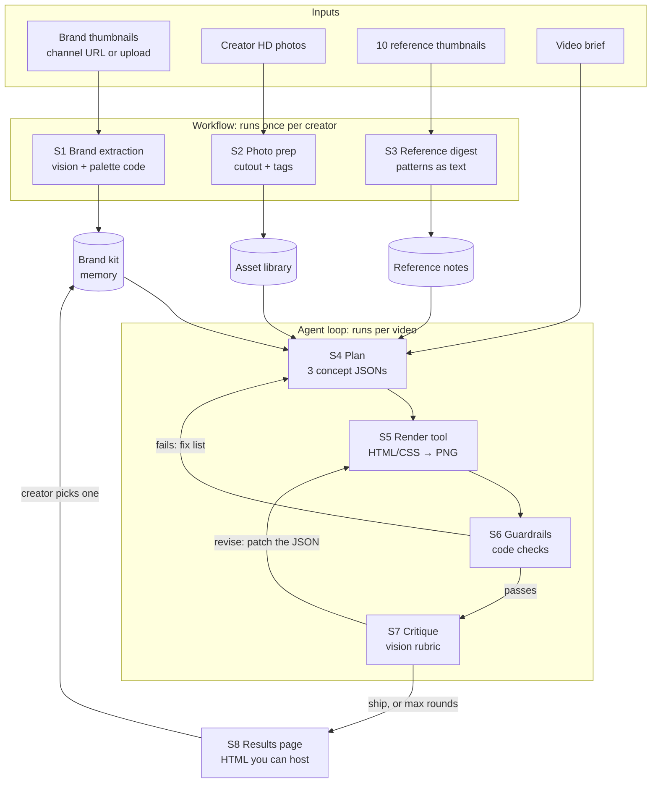

# System design: Thumbnail Agent

Status: **draft v0.1 for review.** Nothing here is built yet. Phase 1 spikes may
change any of it.

## 1. Goal

Given a creator's brand, their photos, 10 reference thumbnails and a video brief,
produce **3 different thumbnail options** that:

- look like the creator's brand, not like a generic AI image,
- stay readable at phone size, where most people see thumbnails,
- use the creator's real face, unchanged,
- come with a score and a short reason, so the creator can trust the choice.

**Not goals for v1:** editing video frames, generating the creator's face,
writing the video title, or posting to YouTube.

## 2. Key design decisions

Each of these is a choice with a reason. Each one is also something worth teaching.

1. **Render the thumbnail with code (HTML/CSS → PNG), not with an AI image model.**
   - Text comes out exactly right. Image models often misspell words, and they
     are worse with Tamil script. A browser renders Tamil correctly with a real
     Tamil font.
   - The creator's brand fonts and colours stay exact.
   - The creator's face is their real photo, never a generated lookalike.
   - It is free, and the same input gives the same result every time, which
     makes evals possible.
   - AI image generation becomes an **optional tool** for backgrounds only. If
     the free tier doesn't cover it, nothing breaks.

2. **The agent edits the recipe, not the pixels.** Every thumbnail is a small
   JSON "concept": template, headline, photo, colours and background. The critic
   doesn't touch the image. It suggests changes to the JSON, and we re-render.
   That keeps each fix precise, small and easy to undo.

3. **Templates first, free-form later.** v1 uses 4–5 layout templates filled from
   JSON. That is reliable and easy to debug. Letting the model write its own
   layout is a Phase 3 experiment, and we only keep it if the evals say it is
   better.

4. **Digest images once, then work in text.** The model doesn't need HD images,
   but the renderer does. We describe the brand thumbnails, references and
   photos **once**, store those descriptions as text, and reuse them on every
   run. The model only sees pixels again when it critiques a render. This keeps
   each call fast and cheap, and it keeps us inside free-tier limits.

5. **Part pipeline, part agent.** Ingest, brand extraction and photo prep always
   run the same steps in the same order, so they are a plain **workflow**. Only
   the design → render → check → critique → fix loop needs the model to make
   decisions, so only that part is the **agent**. Saying this honestly is a trust
   point: most "agents" are mostly workflows.

6. **Rules in code, taste in the model.** Anything measurable is checked by
   code, with no model call: size, word count, contrast and text overlapping
   the face. The model only judges what code can't, such as curiosity, emotion
   and brand feel.

7. **Keep the best so far.** Critique loops can make things worse. We always
   return the highest-scoring version, not the last one.

8. **The model is a config value.** The model id lives in config. We can switch
   Gemini versions, or switch providers, without touching the agent.

## 3. Architecture



## 4. Stages

Each stage has an output you can look at, so a stage can be checked by eye
before the next one starts. Each stage is also a natural episode boundary.

### S0. Ingest

- **Brand thumbnails:** take a channel URL. The channel's public RSS feed lists
  its latest 15 videos, and each video's thumbnail lives at a predictable URL
  (`i.ytimg.com/vi/<videoId>/maxresdefault.jpg`, falling back to `hqdefault.jpg`).
  Manual upload also works. Target 15–30 thumbnails.
- **Creator photos:** 5–15 HD photos with varied expressions (shocked, smiling,
  pointing, thinking), good light, and a plain background if possible.
- **References:** 10 thumbnails, as links or files.
- **Brief:** title or topic, the hook in one line, and the language for the
  thumbnail text (English, Tamil or Tanglish).
- **Check:** all assets load, and each one shows up in a contact sheet.

### S1. Brand extraction (once per creator, rerun on a rebrand)

- **Code:** pull the dominant colours from each thumbnail and merge them into
  one palette.
- **Vision:** describe each thumbnail in structured JSON: layout, face position
  and size, expression, word count, text style and recurring elements. Batch 4–5
  thumbnails per call.
- **Text call:** merge those descriptions into one `BrandKit`, with evidence (which
  thumbnails show each habit).
- **Output:** `brand.json`. It is readable and editable, so the creator can fix
  anything the agent got wrong.
- **Check:** show `brand.json` to the creator and ask "Is this you?" If they
  say no, fix the extraction before building anything on top of it.

### S2. Photo prep

- Remove the background from each HD photo, keeping full resolution (local
  library, free).
- Vision on a **downscaled** copy: expression, gaze direction, framing, face
  bounding box, and which side has empty space for text.
- **Output:** an asset library of cutout PNGs plus tags.
- **Check:** a contact sheet of the cutouts with their tags. Look at hair edges
  especially.

### S3. Reference digest

- Vision on the 10 references: layout type, word count, emotion, colour
  strategy, and *why* it makes you click.
- Merge into "patterns worth borrowing" and "don't copy" notes, stored as text
  and reused on every run.
- **Later:** if the reference library grows to hundreds, embed the thumbnails
  and pull only the closest ones for each brief. That is the retrieval concept.
- **Check:** read the notes. Would a designer agree with them?

### S4. Plan concepts

- One text call takes the brief, brand kit, reference notes and asset tags, and
  returns **3 concepts that genuinely differ** in template, emotion and hook angle.
  The output is validated JSON.
- **Rules:** the headline has at most N words (N comes from the brand kit,
  default 4), and it must not repeat the video title.
- **Check:** the JSON passes the schema, and the 3 concepts differ from each other.

### S5. Render (a tool)

- Concept JSON + template → HTML → headless Chromium screenshot → 1280×720 PNG.
- **v1 templates:** face-left/text-right, face-right/text-left, face-centre/text-top,
  split before/after, and big number.
- The brand kit supplies the fonts, colours, text stroke and shadow.
- **Background options:** brand gradient, a user image (blurred or darkened), or
  AI-generated (an optional tool).
- **Check:** the PNG matches the concept. Tamil text renders correctly, with no
  tofu boxes and no broken letter joins.

### S6. Guardrails (code only, no model call)

| Check | Rule (starting value, tune in Phase 3) |
| --- | --- |
| Size | Exactly 1280×720, file size under 2 MB |
| Headline length | ≤ N words |
| Text size | Rendered text height ≥ ~8% of the canvas height |
| Contrast | Text against the pixels behind it ≥ 4.5:1 |
| Face | The text box doesn't overlap the face bounding box |
| Duration badge | Nothing important in the bottom-right corner, where YouTube shows the video length |
| Safe margins | Text stays inside the margins |
| Font loaded | The real font rendered, not a fallback (catches broken Tamil) |

A failed check goes back as a specific fix, such as "headline too small, raise
it to X". It costs no model call.

### S7. Critique (vision)

- The model sees the render **twice**: at full size and at phone size (about
  320×180).
- **Rubric, scored 1–5:** readable at small size, face and emotion impact,
  contrast and pop, brand match, curiosity gap, and clutter.
- **Returns:** `ship` or `revise`, plus fixes written as patches to the concept
  JSON.
- The critic uses a **separate prompt** from the planner, so it doesn't just
  approve its own work.
- **Check (important):** feed it deliberately broken thumbnails (tiny text,
  covered face, low contrast). If it can't catch the problems we planted, the
  loop is just for show.

### S8. Results and memory

- A static HTML page shows the 3 finals, their scores, before and after for
  each round, PNG downloads, and a "pick this one" button.
- The creator's pick, and the reason, is saved to memory. It nudges the brand
  kit and future planning.

### Loop control (per concept)

- Up to **3** revise rounds.
- Stop when guardrails pass **and** the overall score is ≥ 4 (tune this later).
- Stop early if the score doesn't improve from one round to the next.
- Always return the best version, not the last one.

### Tools the agent can call

| Tool | What it does |
| --- | --- |
| `render_thumbnail(concept)` | Returns the PNG and the layout boxes (text and face positions) |
| `check_guardrails(render)` | Returns pass or fail with a list of fixes |
| `critique(render)` | Returns rubric scores, a verdict and JSON patches |
| `find_photo(query)` | Picks a photo from the asset library by expression or framing |
| `generate_background(prompt)` | Optional. Only if image generation is available |

## 5. Data contracts

These double as schemas. In the app they become zod schemas, so every model
output is validated.

```ts
type BrandKit = {
  palette: { primary: string; accent: string; text: string; backgrounds: string[] };
  typography: {
    feel: "heavy-sans" | "condensed" | "handwritten" | "serif" | "mixed";
    case: "upper" | "title" | "sentence";
    stroke: boolean;
    shadowOrGlow: boolean;
    fontCandidates: string[];      // free fonts that match, e.g. from Google Fonts
  };
  layoutHabits: {
    facePosition: "left" | "right" | "center" | "none";
    faceScale: "close-up" | "half-body" | "full";
    textPosition: "top" | "left" | "right" | "bottom";
    typicalWordCount: number;
  };
  recurringElements: string[];     // arrows, circles, logos, emoji, borders
  mood: string;
  avoid: string[];
  evidence: { thumbnailId: string; note: string }[];
};

type PhotoAsset = {
  id: string;
  cutoutPath: string;              // full-res transparent PNG
  expression: string;              // "shocked", "smiling", "pointing right", ...
  gaze: "left" | "right" | "camera";
  framing: "close-up" | "half-body";
  faceBox: { x: number; y: number; w: number; h: number };  // 0–1, relative
  emptySide: "left" | "right" | "none";
};

type ThumbnailConcept = {
  id: string;
  template: "face-left" | "face-right" | "face-center-top" | "split" | "big-number";
  headline: string;                // ≤ N words, never the full video title
  highlightWord?: string;          // the one word in accent colour
  subtext?: string;
  photoId: string;
  background: { kind: "gradient" | "image" | "ai"; value: string };
  accentColor: string;
  hookAngle: string;               // the curiosity gap, in one line
  rationale: string;
};

type Critique = {
  scores: {
    readabilitySmall: number; faceImpact: number; contrast: number;
    brandMatch: number; curiosity: number; clutter: number;   // each 1–5
  };
  overall: number;
  verdict: "ship" | "revise";
  fixes: { field: keyof ThumbnailConcept; change: string; reason: string }[];
};
```

## 6. Evals: how we know it got better

- **Test set:** 10 briefs from the creator's real past videos. We already have
  the real thumbnail for each one to compare against.
- **Measured on every run:**
  - guardrail pass rate on the first try
  - final rubric score, from a separate judge prompt
  - rounds needed
  - time and model calls per thumbnail
  - **blind pairwise pick: agent vs. the creator's real thumbnail.** You plus 2–3
    people answer "which would you click?" This is the number that matters most.
- **Pairwise beats absolute.** Model judges are inconsistent on 1–5 scales and
  much more reliable at "A or B?"
- **Version every change.** Change one thing, rerun the set, and log it in
  `evals/results.md`. That table is the "watch it get better" story for the series.
- **Final real-world proof:** YouTube Studio's *Test & Compare* on a real upload,
  agent thumbnail vs. handmade.

## 7. Stack (recommended)

| Part | Choice | Why |
| --- | --- | --- |
| Language | TypeScript, front to back | One language for beginners. Matches the series plan |
| App | Next.js | UI and API in one project, deploys to Vercel |
| Agent | Vercel AI SDK | Tool calling, structured output and streaming are built in |
| Model | Gemini (text + vision) | Free tier for building. Model id stays in config |
| Schemas | zod | Validates every model output |
| Render | Headless Chromium (Playwright) | Real browser text shaping, so Tamil renders correctly |
| Image ops | sharp | Resize, crop and sample contrast |
| Cutouts | A local background-removal library | Free, runs offline. Pick one in a spike |

**Why not satori/@vercel/og for rendering?** It is lighter and easier to deploy,
but it lays out text itself, and complex scripts like Tamil may not join
correctly. If Spike 2 shows it handles Tamil fine, we can switch.

## 8. Risks (Phase 1 spikes)

We test these first, each on its own, before building the full app.

1. **Brand extraction:** Can vision describe 15–30 thumbnails accurately enough
   that the creator says "yes, that's my style"?
2. **Rendering quality:** Does an HTML/CSS thumbnail with a real cutout look
   professional, in English and Tamil? Which free Tamil display fonts work
   (Noto Sans Tamil, Mukta Malar, Catamaran, Hind Madurai, Coiny...)?
3. **Critique is real:** Does the critic catch planted problems: tiny text, a
   covered face, low contrast and clutter? If not, the self-critique loop (our
   best episode) has nothing to show.
4. **Free tier:** Do the rate limits survive a brand extraction burst? Is any
   image model on the free tier today? Check in AI Studio, not in blog posts.

Smaller unknowns: cutout quality on hair, and running Chromium on Vercel. That
second one gets settled at the deploy stage, either with serverless Chromium or
with a small separate render service.

## 9. Open questions for you

1. **Test creator:** we start with your own channel. Send the channel URL, 5–15 HD
   photos and 10 reference thumbnails. This repo is public, so photos can't be
   committed here. Choose how to share them: a private repo, a drive link, or
   uploads into this session.
2. **Thumbnail text language:** English, Tamil, Tanglish, or the creator's choice per video?
3. **Stack:** are you OK with TypeScript + Vercel AI SDK (the recommendation above)?
4. **Gemini key:** do you have one for the spikes? Also check in AI Studio whether
   any image model has free quota right now.
